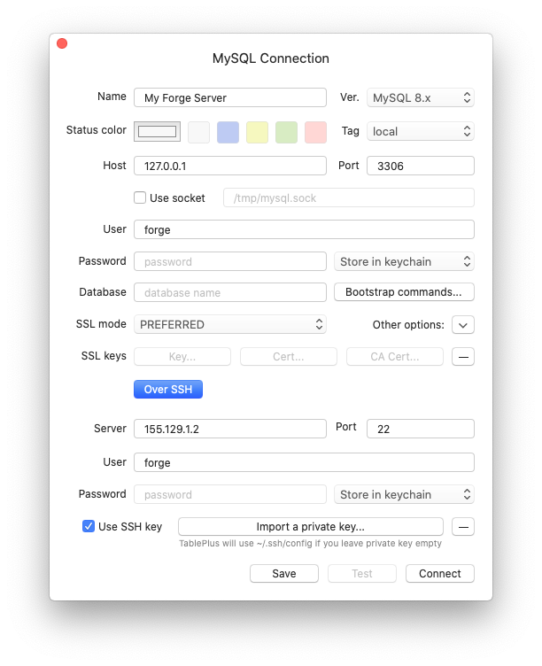

# Databases

[[toc]]

## Overview

When provisioning a new server you may choose to install a database server. You can then use the Forge dashboard to manage databases, users, and permissions.

## Creating a Server With a Database

When creating a new server, you can select to install a database server:

- MySQL (8.0)
- MariaDB (10.3)
- PostgreSQL (12)

As part of the provisioning process, Forge will automatically install the selected database server and create a default `forge` database, `forge` user, and a secure, randomly-generated password. The database password will be shown upon creating the server alongside the root password. These passwords will also be emailed to you.

### Installing Databases Later

If you later decide to that you need to install a database on your server, you can do so through the **Databases** panel. Once installed, you will then be able to manage your database via Forge.

When choosing to install a database, you will be able to select the database type and provide a name for the initial database that Forge creates.

## Changing the Root / Forge Database Password

To reset the `root` and `forge` database user passwords, you may use the password reset functionality.

:::danger Manually changing the root password
Do not change the `root` or `forge` database user passwords manually or outside of the Forge dashboard. Doing so will prevent Forge from being able to connect to, or manage your database.
:::

## Connecting to a Database GUI Client

By default, database connections require SSH key authentication and are not able to be accessed using passwords. Therefore, when using a GUI database client to connect to your Forge database, you will need to use SSH authentication.

When selecting the SSH key to use during authentication, **ensure that you select your private SSH key**. For example, when using the [TablePlus](https://tableplus.com) database client:

### Using the Database Connection URL

Some clients, such as TablePlus, allow you to connect to a database via a connection URL. Forge automatically generates this connection URL for you and you can use it to connect to your database. Note that the password is not included in this URL so you will need to provide your password manually within your database client's GUI.

## Managing Your Databases Within Forge

For servers running MySQL, MariaDB & PostgreSQL, Forge offers some advanced features which allows it to manage your databases and database users easily.

### Creating Databases

You can create a new database through the server's dashboard in Forge. As a minimum you must supply the name of your new database. The `forge` user will be able to access the database automatically.

### Syncing Databases

For consistency, you should use Forge to manage your databases and database users. However, if you created databases outside of the Forge dashboard, you can manually sync them into the Forge dashboard using the **Sync Databases** button.

When syncing databases, Forge will list the databases on your server and create records for any that are missing. Some database names are reserved by their database engine and will not be synced, including:

- `mysql`
- `information_schema`
- `peformance_schema`
- `sys`
- `postgres`
- `template0`
- `template1`

### Create Database Users

You can create extra database users through the Forge dashboard. To do so, you'll need to provide the username, password and select the databases that the new user can access.

## Upgrading Databases

Forge does not provide the ability to upgrade your database server software automatically. If you wish to upgrade your database server, you will need to complete this manually.
